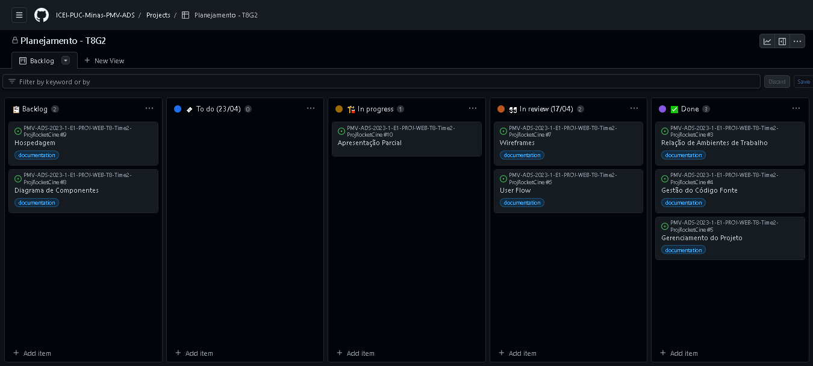

# Metodologia

Pré-requisitos: <a href="2-Especificação do Projeto.md"> Documentação de Especificação</a>

Nesta seção estão apresentadas a Relação de Ambiente de Trabalho, a Gestão do Código Fonte e o Gerenciamento do Projeto em questão. Na Relação de Ambiente de Trabalho, estão apresentadas as plataformas e os respectivos endereços dos arquivos utilizados ao longo do projeto. Já na Gestão do Código Fonte, seguimos a metodologia GitFlow, que nos permite controlar as alterações no código e realizar testes antes de serem integradas na branch principal. E por fim, no Gerenciamento do Projeto, utilizamos a metodologia Scrum, com sprints semanais e uma equipe de desenvolvimento e design responsáveis pela implementação e entrega das funcionalidades.
Utilizamos também o GitHub Project para organizar as tarefas da equipe, fazendo o uso de labels e milestones para priorizar e categorizar as issues. Tudo isso garante uma gestão eficiente e organizada para o desenvolvimento do projeto.

## Relação de Ambientes de Trabalho

Os artefatos do projeto são desenvolvidos a partir de diversas plataformas e a relação dos ambientes com seu respectivo propósito é apresentada na tabela que se segue:

Ambiente|Plataforma|Link de Acesso
|:--------|:----------:|:--------------:|
|Repositório do Código Fonte|GitHub|[GitHub](https://github.com/ICEI-PUC-Minas-PMV-ADS/PMV-ADS-2023-1-E1-PROJ-WEB-T8-Time2-ProjRocketCine)|
|Documentos do projeto|GoogleDocs|[Documentação](https://docs.google.com/document/d/1OV0xoWCWm56ovv-WXnp68zAIG7OMrECO/edit?usp=sharing&ouid=112099303973032315178&rtpof=true&sd=true)|
|Projeto de Interface e  Wireframes|Figma|[Wireframes](https://www.figma.com/file/OoOLaNipYZtjN9zcc28tFp/Projeto-para-o-curso-ads?node-id=0-1&t=jm3Z4pTz1oVrL1Ru-0)|
|Gerenciamento do Projeto|Github Projects|[Projeto Rocket Cine](https://github.com/orgs/ICEI-PUC-Minas-PMV-ADS/projects/372/views/1)|

## Controle de Versão

A ferramenta de controle de versão adotada no projeto foi o
[Git](https://git-scm.com/), sendo que o [Github](https://github.com)
foi utilizado para hospedagem do repositório.

O grupo utiliza um processo baseado no Git Flow para gerenciar o código fonte do software desenvolvido, como ilustrado na figura. Esse processo envolve a realização de todas as manutenções no código em branches separados, que são identificados como Master, Hotfix, Release, Develop e Feature.

O projeto segue a seguinte convenção para o nome de branches:

- `main`: versão estável já testada do software
- `unstable`: versão já testada do software, porém instável
- `testing`: versão em testes do software
- `dev`: versão de desenvolvimento do software

Quanto à gerência de issues, o projeto adota a seguinte convenção para
etiquetas:

- `documentation`: melhorias ou acréscimos à documentação
- `bug`: uma funcionalidade encontra-se com problemas
- `enhancement`: uma funcionalidade precisa ser melhorada
- `feature`: uma nova funcionalidade precisa ser introduzida

Somente as alterações que foram testadas e aprovadas na branch Develop poderão ser transferidas para a branch Master, ou seja, todo o desenvolvimento e testes serão realizados na Develop e somente quando houver uma nova versão do projeto é que será feito o merge com a branch Master.
Para o desenvolvimento de funcionalidades específicas, serão criadas branches temporárias que terão como base a branch Develop. Após finalizar o desenvolvimento e os testes da funcionalidade, faremos o merge entre a Feature e a Develop, para que possamos realizar mais testes antes de finalmente criar uma nova versão do projeto na branch Master.

## Gerenciamento de Projeto

### Divisão de Papéis

- Scrum Master: Leonardo Gabriel de Mattos Campos
- Product Owner: Bruno Henrique Arantes Dias
- Equipe de Desenvolvimento: Bruno Henrique Arantes Dias, Leonardo Gabriel de Mattos Campos, Pedro Ferreira Andrade, Wesley Correa Gomes
- Equipe de Design: Wesley Correa Gomes

### Processo

A distribuição de tarefas da equipe está sendo organizada no GitHub Project, que se encontra estruturado nos seguintes tópicos:

- Backlog: todas as atividades que devem ser realizadas no projeto, desde a documentação até o desenvolvimento final do site.
- To do (atualizado a cada vencimento de prazo): Apresenta o prazo da sprint atual e o que foi definido previamente para ser  realizado até o final da mesma.
- In progress: O que está sendo feito.
- In Review (atualizado semanalmente): O que precisa ser revisado junto ao orientador.
- Done: Tudo o que foi finalizado.

### Ferramentas

As ferramentas empregadas no projeto são:

- Editor de código: Visual Code Studio
- Ferramentas de comunicação: WhatsApp, Discord e Microsoft Teams
- Ferramentas de desenho de tela (_wireframing_): Figma

O editor de código foi escolhido porque ele possui uma integração com o
sistema de versão. As ferramentas de comunicação utilizadas possuem
integração semelhante e por isso foram selecionadas. Por fim, para criar
diagramas utilizamos essa ferramenta por melhor captar as
necessidades da nossa solução.
