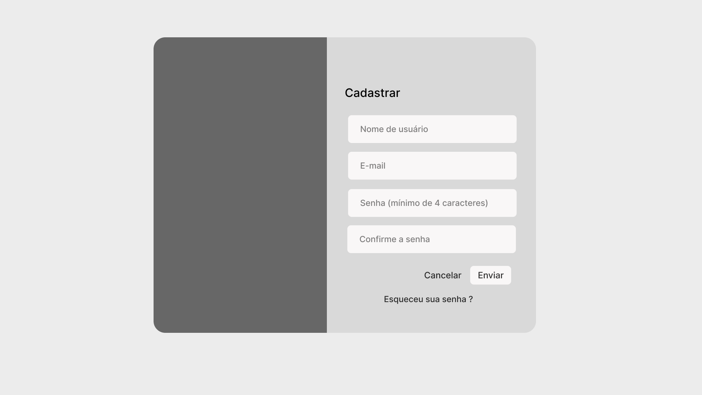

# Projeto de Interface

Pré-requisitos: <a href="2-Especificação do Projeto.md"> Documentação de Especificação</a>

Dentre as preocupações para a montagem da interface do projeto, buscamos estabelecer melhores funcionalidades e interações dos usuários dentro do site. Tendo um design intuitivo e de fácil utilização, contendo interações de telas e funcionalidades únicas de fácil uso, buscando o funcionamento em desktops e dispositivos móveis.

## User Flow

O diagrama apresentado abaixo mostra as funcionalidades do projeto e as interações que os usuários podem ter pelas telas do site. Cada uma das telas deste fluxo é detalhada na seção de Wireframes que se segue.

## Wireframes

Com base no fluxo de usuário mostrado anteriormente, serão apresentadas em detalhes nesta seção as telas pertencentes ao projeto. Elas se encontram estruturadas em  3 grandes blocos:

- Cabeçalho - navegação principal do site (menu da aplicação);
- Conteúdo - apresenta o conteúdo da tela em questão;
- Barra lateral - local onde são dispostos elementos fixos de identidade (logo) e apresenta os elementos de navegação secundária, como por exemplo: seleção de gênero e mais avaliados.

### Home Page

A página inicial exibe uma seleção de filmes com base na API usada pelo sistema. Além disso, ela apresenta conteúdos e funções relevantes para os usuários, como filmes em destaque, os mais recentes, os favoritos dos fãs, pesquisa e séries. A barra lateral da página contém dois componentes:

- Componente de seleção de gênero - permite ao usuário escolher qual gênero deseja observar.
- Componente de mais avaliados - o usuário pode visualizar quais são os filmes/séries mais bem avaliados no site.

### Página de Gênero

Após entrar no site, o usuário pode selecionar um gênero na home page, sendo assim redirecionado para a página do mesmo. Nessa tela, o usuário pode visualizar os filmes/séries do gênero selecionado e optar por qual filme/série deseja obter informações ou avaliar.

### Página de Filme/Comentários

Quando um usuário escolhe um filme na página de gênero, ele é direcionado para a sua página, onde tem acesso a informações detalhadas como título, sinopse, elenco, entre outras. Nessa página, é possível também avaliar e comentar sobre o filme.

### Cadastro

Caso o usuário ainda não tenha uma conta no site e decida clicar no botão de cadastro presente na tela de login, ele abrirá o pop-up da tela de cadastro. Nessa tela, o usuário deverá preencher um formulário com suas informações pessoais, como nome, e-mail e a senha desejada, para criar sua conta no sistema.

### Login

Se o usuário clicar no botão de login presente na home page, ele abrirá o pop-up da tela de login. Nessa tela, o usuário pode inserir suas credenciais, como o nome de usuário e a senha, para acessar sua conta no sistema. Há também a opção de recuperação de senha, caso o usuário tenha esquecido suas informações.

