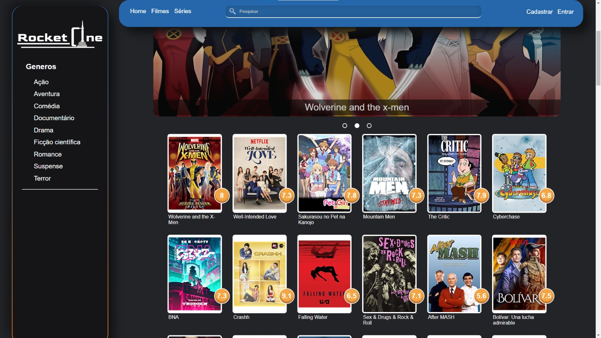
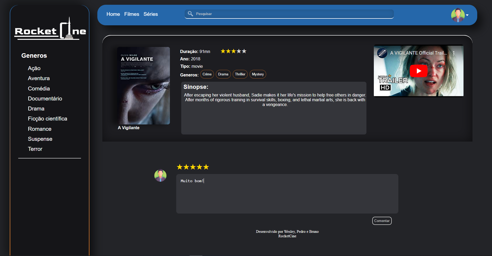

# Template padrão do site

Pré-requisitos: <a href="2-Especificação do Projeto.md"> Especificação do Projeto</a>, <a href="3-Projeto de Interface.md"> Projeto de Interface</a>, <a href="4-Metodologia.md"> Metodologia</a>

O layout utilizado para a realização do site é correspondente ao projeto de interface elaborado anteriormente no capítulo 4, conforme apresentado a seguir:

O template criado está disponível no site: https://github.com/ICEI-PUC-Minas-PMV-ADS/PMV-ADS-2023-1-E1-PROJ-WEB-T8-Time2-ProjRocketCine/blob/main/docs/img/Template%20do%20Site.png, e contém as seguintes páginas:

* Tela principal;
* Página de filtragem por tipo e gênero
* Página do filme;

## Tela Principal

Tela que contém a base do site, onde, a partir dela, conseguimos navegar por toda a aplicação. Nela estão apresentados os filmes em destaque e o catálogo de filmes.

## Página de Filtragem por Tipo e Gênero

Essa tela exibe os filmes ou séries filtrados por categoria e gênero.

## Página do Filme

Página que fornece as especificações individuais do filme ao qual ela é destinada.

