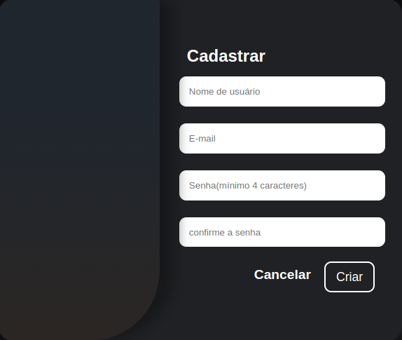
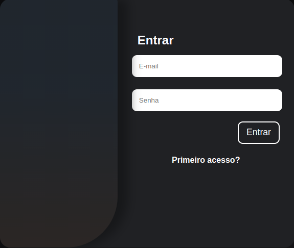
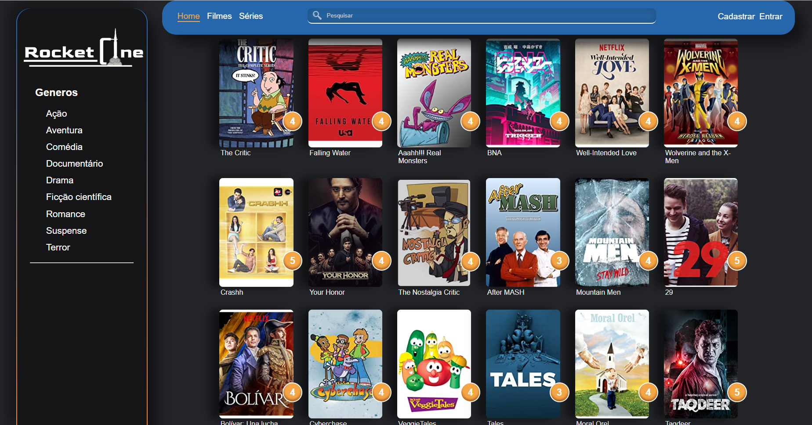
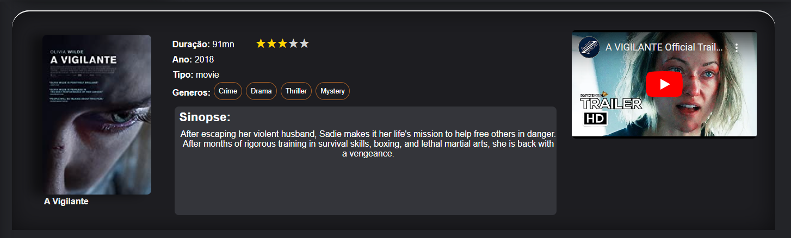

# Programação de Funcionalidades

Pré-requisitos: <a href="2-Especificação do Projeto.md"> Especificação do Projeto</a>, <a href="3-Projeto de Interface.md"> Projeto de Interface</a>, <a href="4-Metodologia.md"> Metodologia</a>, <a href="3-Projeto de Interface.md"> Projeto de Interface</a>, <a href="5-Arquitetura da Solução.md"> Arquitetura da Solução</a>

Nesta seção serão apresentadas as telas desenvolvidas para cada uma das funcionalidades do sistema, especificadas durante os Requisitos Funcionais.

## Cabeçalho e Barra Lateral (RF-03, RF-09, RF-10)

Para uma melhor organização dos elementos que estariam presentes em todas as páginas do projeto, criamos um cabeçalho e uma barra lateral onde estarão alocadas algumas das funcionalidades do site. No cabeçalho, estão presentes o botão “Home”, os botões de filtragem entre filmes e séries, a barra de pesquisa e os sistemas de login e cadastro. Já na barra lateral, foi inserida a lista de filtragem por gênero.

Para uma melhor visualização, ambas as estruturas estão apresentadas na página estrutural do site que está a seguir:

### Responsável pela Funcionalidade
* Wesley Correa Gomes

### Requisitos Atendidos
* RF- 03 - mecanismo de pesquisa e filtragem
* RF-09 - botão home
* RF-10 - barra de pesquisa

### Artefatos da Funcionalidade
* Index.html
* Index.css
* Index.js
* filmes.js

## Sistema de Cadastro/Login (RF-04)

O campo de cadastro permite que o usuário crie uma conta inserindo informações pessoais como, nome completo, e-mail, senha com no mínimo 4 caracteres e confirmação de senha. Já na janela de login, estão presentes o campo para inserir o nome de usuário e a senha, além de um botão que leva para a tela de cadastro, caso o usuário ainda não o tenha realizado.

### Responsável pela Funcionalidade
* Wesley Correa Gomes

### Requisitos Atendidos
* RF-04 - Login/Cadastro

### Artefatos da Funcionalidade
* Index.html
* Index.css
* Index.js

## Carrossel de Destaques (RF-07)

O carrossel de filmes e séries em destaque exibe banners dos principais filmes do momento a paratir de um sistema de rolagem automática.

### Responsável pela Funcionalidade
* Pedro Ferreira Andrade

### Requisitos Atendidos
* RF-07 - Carrossel de Filmes em Destaque

### Artefatos da Funcionalidade
* Index.html
* Index.css
* Index.js

## Catálogo de Filmes (RF-06)

O catálogo de filmes tem como o objetivo auxiliar usuários a uma melhor interação com a plataforma, apresentando a lista de filmes disponível junto com suas respectivas capas, avaliações e títulos.

### Responsável pela Funcionalidade
* Bruno Henrique Arantes Dias

### Requisitos Atendidos
* RF-06 - Catálogo de Filmes/séries

### Artefatos da Funcionalidade
* Index.html
* Index.css
* Filmes.js

## Especificações do Filme (RF-05)

Espaço destinado a apresentar as informações técnicas sobre cada filme individualmente, bem como avaliações, trailer, sinopse, duração, ano, tipo e gêneros.

### Responsável pela Funcionalidade
* Pedro Ferreira Andrade

### Requisitos Atendidos 
* RF-05 - Especificações do Filme

### Artefatos da Funcionalidade
* Index.html
* Index.css
* Filmes.js

## Sistema de comentários (RF-01, RF-02)

Espaço destinado a apresentar os comentários e avaliações dos usuários sobre o filme em questão.

### Responsável pela Funcionalidade
* Wesley Correa Gomes

### Requisitos Atendidos 
* RF-01 - Avaliação por Estrelas
* RF-02 - Comentários/Avaliações

### Artefatos da Funcionalidade
* Index.html
* Index.css
* Filmes.js
